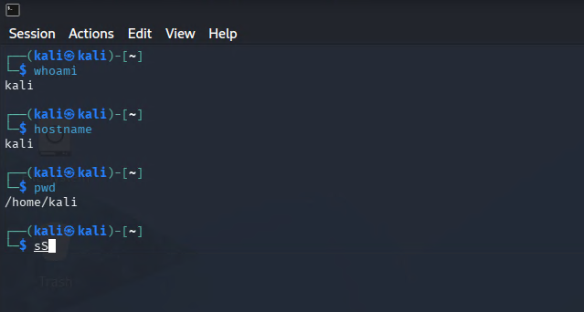
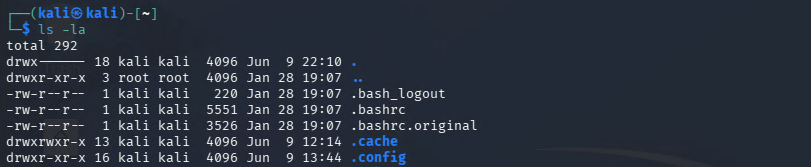
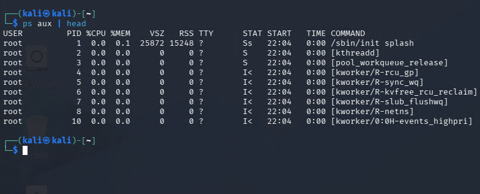

# Day 01 - Linux CLI Fundamentals

## Objective

Learn and practice fundamental Linux command-line skills used by Security Engineers, SOC Analysts, and System Administrators.

---

## Learning Resources

* TryHackMe - Linux CLI - Shells Bells
* Personal Homelab Ubuntu VM

---

## Commands Learned

### Navigation

* `pwd`
* `ls`
* `cd`

### File Operations

* `mkdir`
* `touch`
* `cp`
* `mv`
* `rm`

### Viewing Data

* `cat`
* `head`
* `tail`
* `less`

### Searching

* `grep`
* `find`

### Permissions

* `chmod`

### System Information

* `whoami`
* `hostname`
* `ps`

---

## Practical Activities

Completed hands-on exercises using a Linux virtual machine.

### User and Host Identification

Commands:

```bash
whoami
hostname
pwd
```

Purpose:

* Identify the current user
* Verify system hostname
* Determine current working directory

Screenshot:



---

### Directory and File Enumeration

Commands:

```bash
ls -la
```

Purpose:

* View files and directories
* Display hidden files
* Inspect file permissions

Screenshot:



---

### Process Enumeration

Commands:

```bash
ps aux
```

Purpose:

* View active processes
* Identify running services
* Understand process visibility on Linux systems

Screenshot:



---

## Script Created

Created a simple Linux practice script:

```text
command.sh
```

Purpose:

* Practice Linux commands
* Automate basic system information gathering
* Improve familiarity with shell execution

Execution:

```bash
chmod +x command.sh
./command.sh
```

---

## Key Takeaways

* Learned fundamental Linux navigation commands.
* Practiced file and directory management.
* Explored basic process enumeration.
* Understood how Linux commands support security investigations.
* Built confidence working directly from the terminal.

---

## Next Steps

Day 02 - DNS in Detail

Goals:

* Understand DNS resolution
* Learn common DNS record types
* Capture DNS traffic using Wireshark
* Analyze DNS requests and responses
* Document findings in the homelab

---

## CyberSec30 Progress

* [x] Day 01 - Linux CLI Fundamentals
* [ ] Day 02 - DNS in Detail
* [ ] Day 03 - Intro to Logs
* [ ] Day 04 - Linux Logging for SOC
* [ ] Day 05 - Traffic Analysis Essentials
