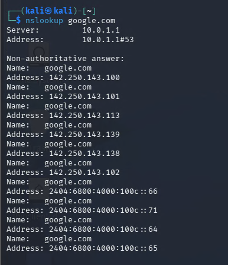
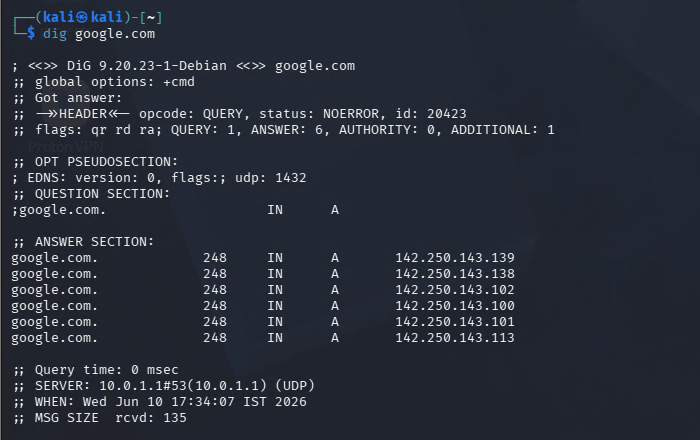
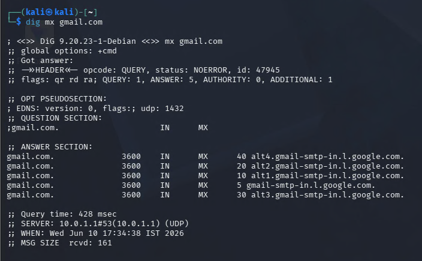
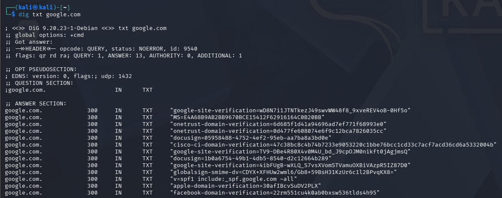
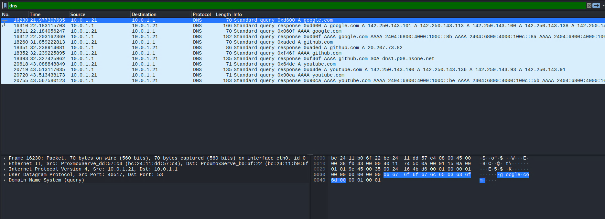
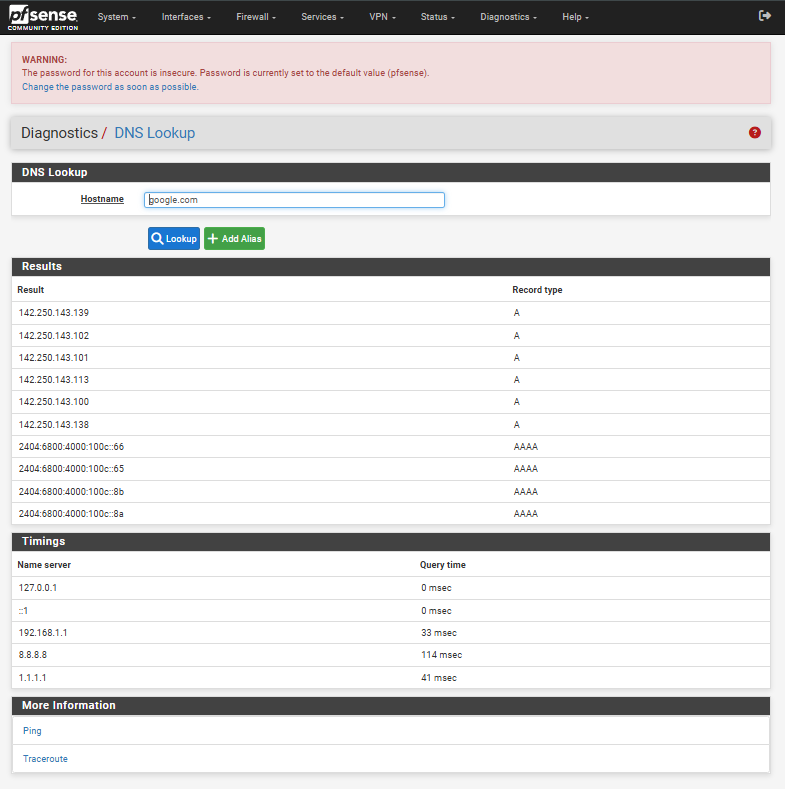

# Day 02 - DNS in Detail

## Objective

Learn how the Domain Name System (DNS) works and understand how DNS resolution occurs inside my cybersecurity homelab.

The goal of this exercise was to:

* Understand DNS fundamentals
* Learn common DNS record types
* Perform DNS lookups using Linux tools
* Capture DNS traffic using Wireshark
* Observe DNS resolution through pfSense
* Relate DNS concepts to SOC analyst investigations

---

## Learning Resources

* TryHackMe - DNS in Detail
* Kali Linux VM
* Wireshark
* pfSense Community Edition
* Personal Proxmox Homelab

---

# DNS Overview

DNS (Domain Name System) translates human-readable domain names into IP addresses that computers can use for communication.

Example:

```text
google.com
        ↓
142.250.143.100
```

Without DNS, users would need to remember IP addresses instead of domain names.

---

# DNS Record Types

| Record | Purpose                     | Example                                 |
| ------ | --------------------------- | --------------------------------------- |
| A      | Maps domain to IPv4 address | google.com                              |
| AAAA   | Maps domain to IPv6 address | google.com                              |
| MX     | Specifies mail servers      | gmail.com                               |
| TXT    | Stores text information     | SPF records                             |
| CNAME  | Domain alias                | [www.google.com](http://www.google.com) |
| NS     | Authoritative nameserver    | google.com                              |

---

# Practical Activities

## Task 1 - nslookup

Command:

```bash
nslookup google.com
```

Screenshot:



### Findings

DNS Server Used:

```text
10.0.1.1
```

This is the pfSense firewall acting as the DNS resolver for the homelab.

The query returned:

* Multiple IPv4 addresses
* Multiple IPv6 addresses

This demonstrates how large services use multiple servers for availability and load balancing.

---

## Task 2 - dig A Record Lookup

Command:

```bash
dig google.com
```

Screenshot:



### Findings

Returned DNS Record Type:

```text
A Record
```

Example:

```text
142.250.143.139
```

Purpose:

Maps a domain name to an IPv4 address.

TTL Observed:

```text
248 seconds
```

TTL (Time To Live) determines how long the DNS response may remain cached before a new lookup is required.

---

## Task 3 - MX Record Lookup

Command:

```bash
dig mx gmail.com
```

Screenshot:



### Findings

MX records identify mail servers responsible for receiving email.

Example:

```text
gmail-smtp-in.l.google.com
```

Priority Values:

```text
5
10
20
30
40
```

Lower numbers indicate higher priority mail servers.

TTL Observed:

```text
3600 seconds
```

This means the response may be cached for one hour.

---

## Task 4 - TXT Record Lookup

Command:

```bash
dig txt google.com
```

Screenshot:



### Findings

TXT records contain textual information associated with a domain.

Examples observed:

* google-site-verification
* docusign verification
* apple-domain-verification
* facebook-domain-verification
* SPF configuration

Purpose:

* Domain ownership verification
* Email authentication
* Third-party service integration
* Security policy implementation

---

# Wireshark DNS Analysis

Filter Used:

```text
dns
```

Screenshot:



### Observations

Source(Kali):

```text
10.0.1.21
```

Destination(pfSense):

```text
10.0.1.1
```

Meaning:

```text
Kali VM
    ↓
pfSense DNS Resolver
    ↓
Internet DNS
    ↓
Response Returned
```

Captured:

* A Record Queries
* A Record Responses
* AAAA Record Queries
* AAAA Record Responses

This demonstrates the complete DNS resolution workflow inside the homelab.

---

# pfSense DNS Investigation

Screenshot:



### Findings

The pfSense firewall successfully resolved:

```text
google.com
```

Returned:

* A Records
* AAAA Records

The firewall is acting as a DNS resolver for internal clients.

This centralizes DNS management and allows monitoring of DNS activity.

---

# Remote Lab Access

The pfSense firewall is connected to my Tailscale network.

Using Tailscale and firewall rules, I can:

* Access pfSense remotely
* Manage virtual machines remotely
* Investigate network traffic from outside the local network
* Maintain connectivity to the cybersecurity homelab

Architecture:

```text
Laptop
   │
Tailscale
   │
pfSense (10.0.1.1)
   │
Firewall Rules
   │
Internal VMs
```

---

# SOC Relevance

DNS is one of the most valuable data sources for security investigations.

SOC analysts frequently use DNS data for:

* Threat hunting
* IOC investigation
* Malware analysis
* Phishing investigations
* Domain reputation analysis
* DNS tunneling detection

Examples:

* Suspicious domains
* Command-and-Control traffic
* Malware callbacks
* Data exfiltration through DNS

---

# Key Takeaways

* Learned how DNS resolution works.
* Identified the role of A, AAAA, MX, and TXT records.
* Performed DNS investigations using Linux tools.
* Captured DNS traffic using Wireshark.
* Observed DNS activity through pfSense.
* Connected DNS theory with a real cybersecurity homelab.
* Understood the importance of DNS monitoring in SOC operations.

---

# Next Steps

Day 03 - Intro to Logs

Goals:

* Understand Linux logging
* Explore auth.log
* Learn journalctl
* Generate authentication events
* Investigate log entries
* Prepare for SIEM and Wazuh integration

---

# CyberSec30 Progress

* [x] Day 01 - Linux CLI Fundamentals
* [x] Day 02 - DNS in Detail
* [ ] Day 03 - Intro to Logs
* [ ] Day 04 - Linux Logging for SOC
* [ ] Day 05 - Traffic Analysis Essentials
