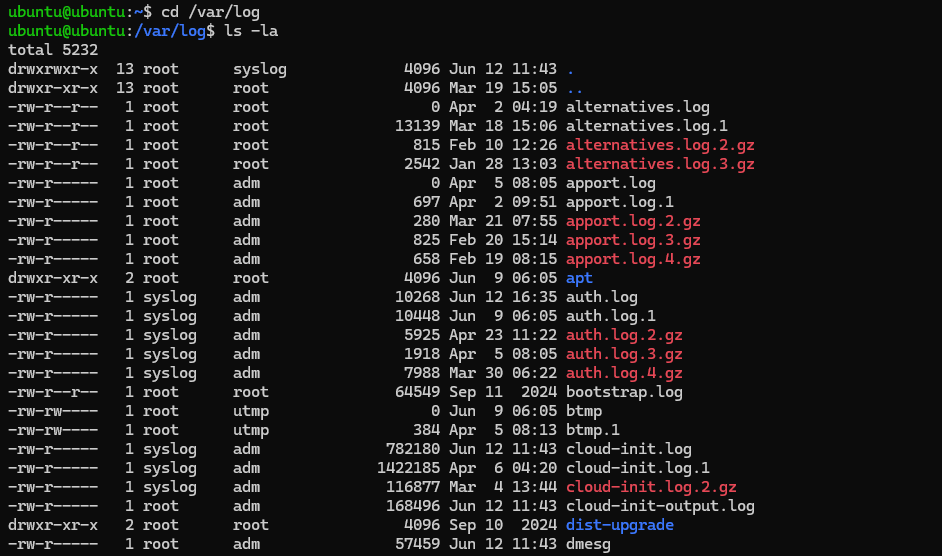
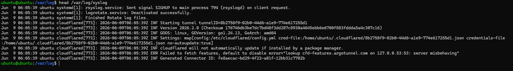
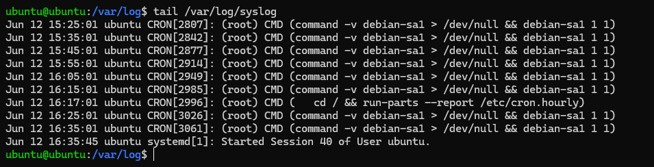
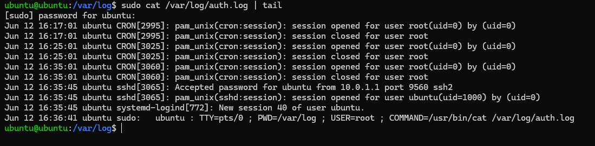
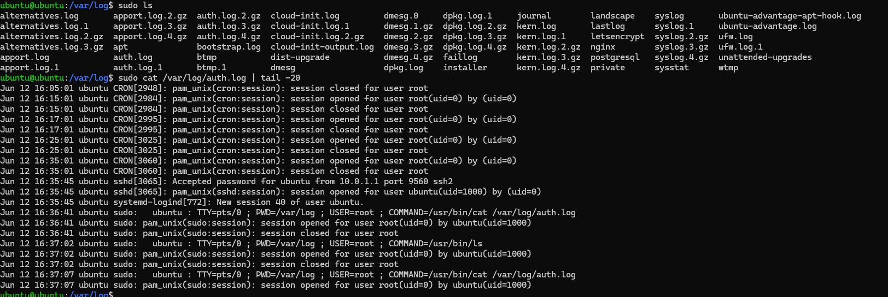
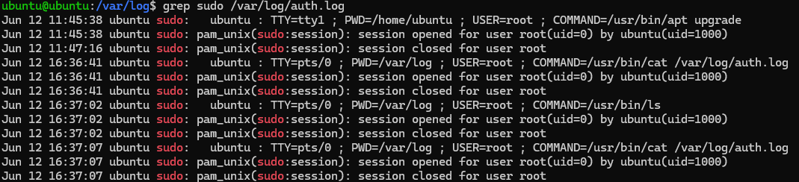
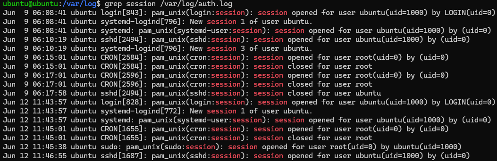

# Day 03 - Introduction to Logs

## Objective

Learn how Linux systems record events and how Security Operations Center (SOC) analysts use logs to investigate system activity, authentication events, and user actions.

---

## Why Logs Matter

Logs provide evidence of activity occurring on a system. They help security analysts:

* Investigate incidents
* Monitor user activity
* Detect suspicious behavior
* Track authentication attempts
* Support threat hunting and forensic investigations

Without logs, it would be difficult to determine what happened on a system and when it happened.

---

## Lab Environment

* Operating System: Ubuntu Linux
* Investigation Directory: `/var/log`
* User: `ubuntu`
* Tools Used:

  * ls
  * head
  * tail
  * grep
  * sudo

---

# Task 1 - Explore Linux Log Directory

### Command

```bash
cd /var/log
ls -la
```

### Screenshot



### Findings

Ubuntu stores system and application logs inside `/var/log`.

Important log files discovered:

| Log File       | Purpose                          |
| -------------- | -------------------------------- |
| auth.log       | Authentication and sudo activity |
| syslog         | General system events            |
| kern.log       | Kernel events                    |
| dpkg.log       | Package installation activity    |
| ufw.log        | Firewall logs                    |
| cloud-init.log | Cloud initialization events      |

### Observation

The `/var/log` directory serves as a central location for system and application logging.

---

# Task 2 - Review System Logs

### Command

```bash
head /var/log/syslog
```

### Screenshot



### Findings

The syslog file contained:

* systemd events
* rsyslog activity
* cloudflared service events
* informational messages
* error messages

### Observation

System logs contain information generated by operating system services and applications.

---

# Task 3 - Review Recent System Activity

### Command

```bash
tail /var/log/syslog
```

### Screenshot



### Findings

Recent events included:

* CRON scheduled tasks
* User session creation
* Background system activity

### Observation

The tail command helps investigators quickly view the most recent system events.

---

# Task 4 - Investigate Authentication Logs

### Command

```bash
sudo cat /var/log/auth.log | tail
```

### Screenshot



### Findings

The authentication log recorded:

* Successful SSH logins
* Session creation events
* Sudo activity
* User authentication records

Example event:

```text
Accepted password for ubuntu from 10.0.1.1
```

### Observation

Authentication logs are one of the most important sources used during security investigations.

---

# Task 5 - Generate a Log Event

### Command

```bash
sudo ls
```

Followed by:

```bash
sudo cat /var/log/auth.log | tail -20
```

### Screenshot



### Findings

The authentication log recorded the privileged command execution.

Example:

```text
COMMAND=/usr/bin/ls
```

Additional details included:

* User account
* Terminal used
* Working directory
* Command executed

### Observation

Linux logs provide a clear audit trail of privileged user actions.

---

# Task 6 - Search Logs Using Grep

## Search for Sudo Activity

### Command

```bash
grep sudo /var/log/auth.log
```

### Screenshot



### Findings

Located multiple sudo events showing:

* User name
* Executed command
* Session creation
* Session termination

---

## Search for Session Activity

### Command

```bash
grep session /var/log/auth.log
```

### Screenshot



### Findings

Located:

* Login sessions
* SSH sessions
* CRON sessions
* Sudo sessions

### Observation

Searching logs allows analysts to quickly identify specific events during investigations.

---

# Investigation Scenario

## Objective

Determine whether a user executed privileged commands on the system.

## Evidence Collected

Authentication logs showed:

* Successful SSH authentication
* User session creation
* Multiple sudo events
* Command execution records

Example:

```text
COMMAND=/usr/bin/ls
```

## Conclusion

The user `ubuntu` successfully authenticated to the system and executed privileged commands using sudo. Evidence was identified within `/var/log/auth.log`.

---

# Key Takeaways

* Logs are critical sources of forensic evidence.
* Ubuntu stores important security events in `/var/log`.
* Authentication activity is recorded in `auth.log`.
* System-wide events are stored in `syslog`.
* Analysts can use grep to quickly locate relevant events.
* Privileged actions performed with sudo leave an audit trail.

---

# SOC Relevance

Logs are one of the primary data sources used by SOC analysts.

Common SOC use cases include:

* Investigating security incidents
* Monitoring user activity
* Detecting unauthorized access
* Reviewing authentication events
* Supporting threat hunting activities

Understanding log analysis is a foundational skill for SOC Analysts and Security Engineers.
