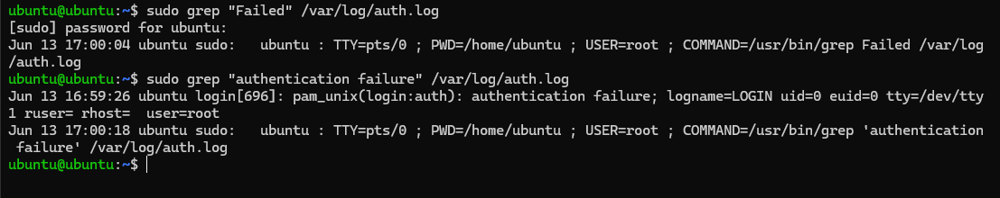
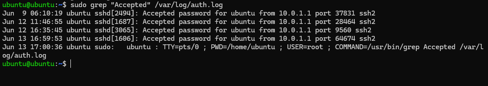
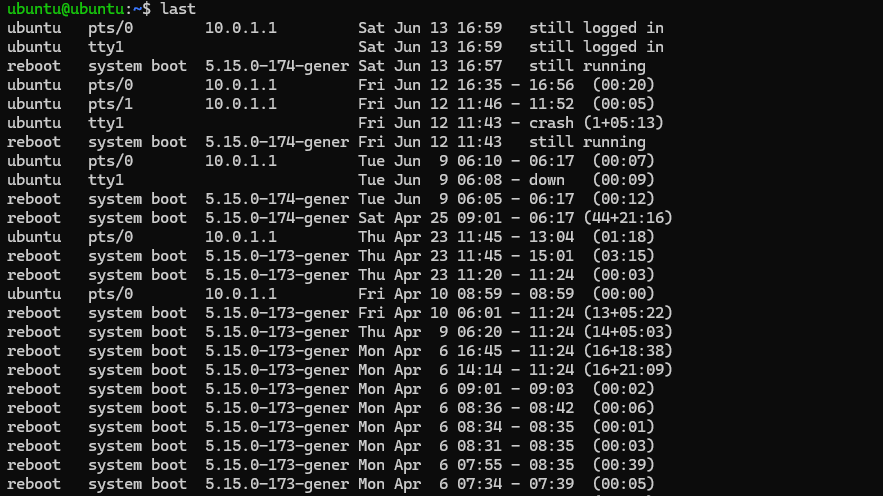
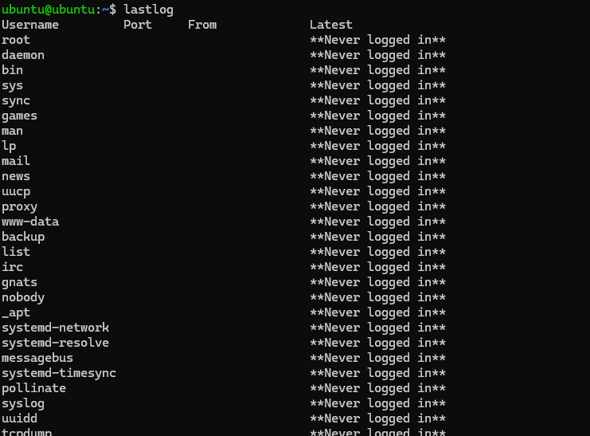
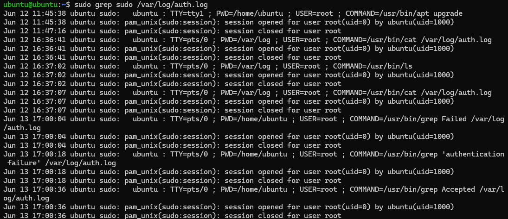
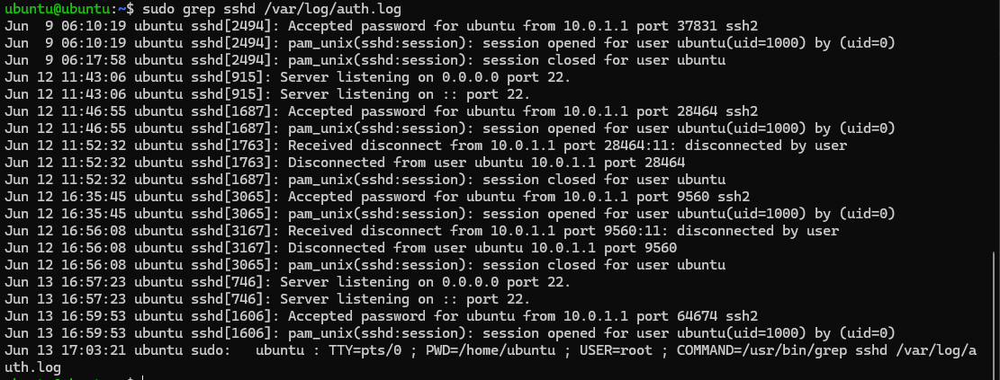
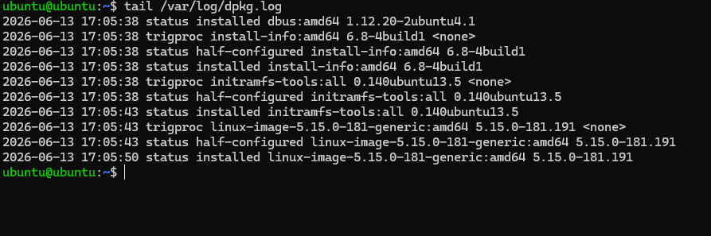

# Day 04 - Linux Logging for SOC

## Objective

Learn how SOC Analysts use Linux logs to investigate authentication events, user activity, SSH access, privileged commands, and system changes.

---

# Why Linux Logs Matter

Linux logs provide evidence of activity occurring on a system. Security analysts use logs to:

* Investigate incidents
* Detect unauthorized access
* Review user activity
* Monitor privileged command execution
* Track software installation and updates
* Support threat hunting activities

Understanding Linux logs is a fundamental SOC Analyst skill.

---

# Lab Environment

* Operating System: Ubuntu Linux
* Investigation Target: Local Ubuntu VM
* Log Sources:

  * `/var/log/auth.log`
  * `/var/log/syslog`
  * `/var/log/dpkg.log`
  * `last`
  * `lastlog`

---

# Task 1 - Investigate Failed Logins

## Commands

```bash
sudo grep "Failed" /var/log/auth.log
sudo grep "authentication failure" /var/log/auth.log
```

## Screenshot



## Findings

One authentication failure event was identified:

```text
authentication failure
```

The event indicates that an authentication attempt failed during the login process.

## Observation

Failed authentication events may indicate:

* Incorrect passwords
* User mistakes
* Password spraying
* Brute-force activity

These events should always be reviewed by security analysts.

---

# Task 2 - Investigate Successful Logins

## Command

```bash
sudo grep "Accepted" /var/log/auth.log
```

## Screenshot



## Findings

Multiple successful SSH logins were identified.

Example:

```text
Accepted password for ubuntu from 10.0.1.1
```

Information obtained:

* Username: ubuntu
* Source IP: 10.0.1.1
* Service: SSH
* Authentication Method: Password

## Observation

Successful authentication events help analysts identify who accessed the system and from where.

---

# Task 3 - Review User Sessions

## Commands

```bash
last
```

```bash
lastlog
```

## Screenshots





## Findings

The system recorded:

* User login sessions
* Session durations
* Reboot events
* Active user sessions

The user `ubuntu` was observed connecting from:

```text
10.0.1.1
```

## Observation

The `last` command is useful for identifying historical user activity and login timelines.

---

# Task 4 - Investigate Sudo Activity

## Command

```bash
sudo grep sudo /var/log/auth.log
```

## Screenshot



## Findings

Multiple privileged commands were executed using sudo.

Examples:

```text
COMMAND=/usr/bin/ls
COMMAND=/usr/bin/cat
COMMAND=/usr/bin/grep
```

Additional information recorded:

* Username
* Working directory
* Terminal used
* Timestamp
* Executed command

## Observation

Every sudo command leaves an audit trail that can be investigated later.

---

# Task 5 - Investigate SSH Activity

## Command

```bash
sudo grep sshd /var/log/auth.log
```

## Screenshot



## Findings

SSH-related events identified:

* Successful logins
* Session creation
* Session closure
* User disconnects
* SSH daemon startup

Examples:

```text
Accepted password for ubuntu
session opened
session closed
Received disconnect
```

## Observation

SSH logs are critical during incident response investigations because they reveal remote access activity.

---

# Task 6 - Investigate Package Installation Activity

## Command

```bash
tail /var/log/dpkg.log
```

## Screenshot



## Findings

Recent package management activity was identified.

Packages observed:

```text
install-info
initramfs-tools
linux-image-5.15.0-181-generic
```

The logs recorded:

* Installation status
* Package updates
* Configuration changes

## Observation

Package logs help analysts determine when software was installed, upgraded, or removed from a system.

---

# Mini Investigation

## Scenario

A SOC analyst receives an alert indicating that a user logged into a Linux server and executed privileged commands.

## Objective

Determine:

* User account
* Login source
* Login time
* Commands executed
* Evidence location

---

## Evidence Collected

### Authentication Logs

Location:

```text
/var/log/auth.log
```

Evidence identified:

```text
Accepted password for ubuntu from 10.0.1.1
```

---

### Session Activity

Evidence identified:

```text
session opened
session closed
```

---

### Privileged Commands

Evidence identified:

```text
COMMAND=/usr/bin/ls
COMMAND=/usr/bin/cat
COMMAND=/usr/bin/grep
```

---

## Findings

The user `ubuntu` successfully authenticated through SSH from IP address:

```text
10.0.1.1
```

The user subsequently executed multiple privileged commands using sudo.

All activity was recorded in:

```text
/var/log/auth.log
```

---

## Conclusion

The investigation confirmed that the user successfully logged into the system and executed privileged commands.

Authentication logs, session records, and sudo events provided sufficient evidence to reconstruct the activity timeline.

---

# Key Takeaways

* Linux systems maintain detailed authentication logs.
* SSH activity can be reconstructed using auth.log.
* Sudo commands leave a complete audit trail.
* The `last` and `lastlog` utilities provide login history.
* Package installation logs help track system changes.
* Logs are one of the most valuable sources of evidence during investigations.

---

# SOC Relevance

SOC Analysts regularly use Linux logs to:

* Investigate incidents
* Detect unauthorized access
* Review privileged activity
* Validate alerts
* Perform threat hunting
* Support forensic investigations

Understanding Linux log analysis is a foundational cybersecurity skill and a core responsibility of Security Operations Center personnel.
