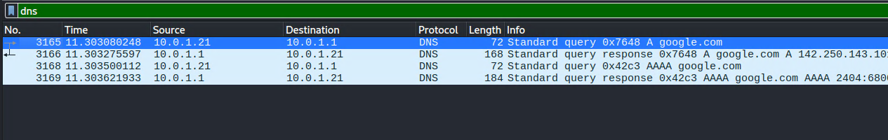
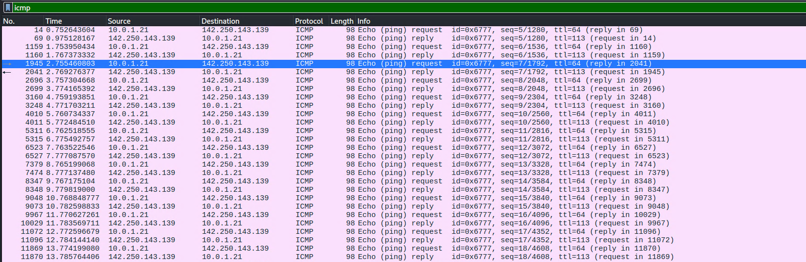
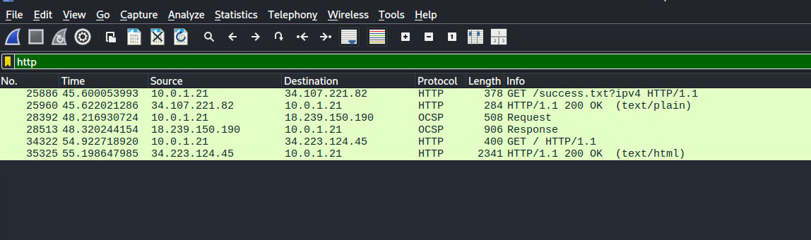
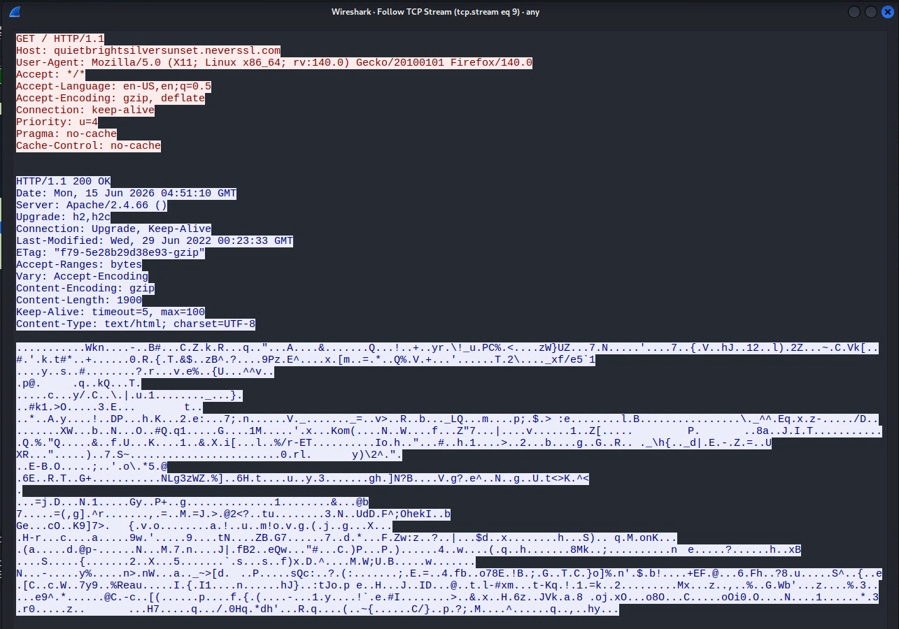
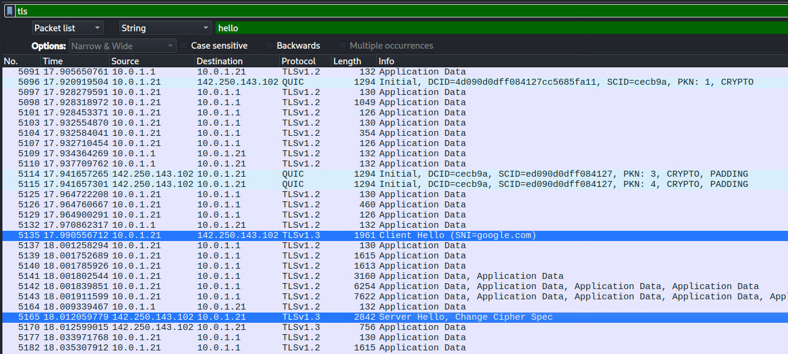
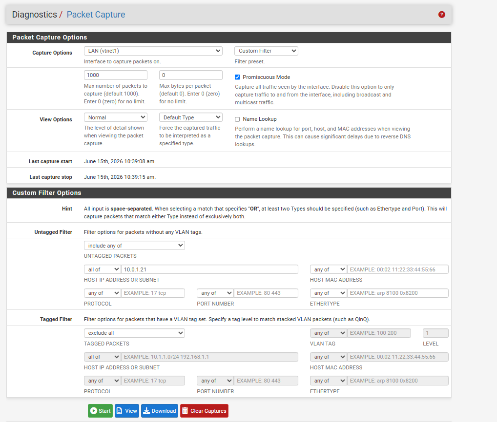
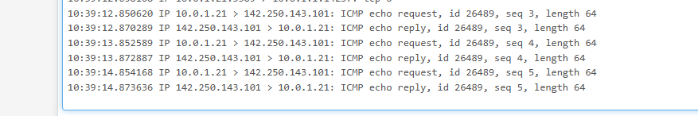

# Day 05 - Traffic Analysis Essentials

## Objective

Learn how to capture and analyze network traffic using Wireshark and pfSense. Understand how DNS, ICMP, HTTP, and TLS traffic appears on a network and how packet analysis can be used to troubleshoot systems and investigate network activity.

## Lab Environment

### Infrastructure I used :

- Proxmox VE
- pfSense Firewall (10.0.1.1)
- Kali Linux VM (10.0.1.21)
- Wireshark
- pfSense Packet Capture
- Internet Access

### Network Flow

```text
Kali Linux
    ↓
pfSense Firewall
    ↓
Internet
```

---

## Task 1 - DNS Traffic Analysis

### Activity

Generated DNS traffic using:

```bash
nslookup google.com
```

### Findings

Captured DNS requests and responses between Kali Linux and pfSense.

### Screenshot



### Notes

- Kali sent a DNS query for google.com.
- pfSense DNS Resolver returned IPv4 and IPv6 addresses.
- DNS communication used UDP port 53.

### What I Learned

DNS is responsible for translating domain names into IP addresses before a connection can be established.

---

## Task 2 - ICMP Traffic Analysis

### Activity

Generated ICMP traffic:

```bash
ping google.com -c 5
```

### Screenshot



### Findings

- ICMP Echo Requests were sent to Google.
- ICMP Echo Replies were received successfully.
- No packet loss was observed.

### What I Learned

ICMP is commonly used to verify connectivity and measure response times between systems.

---

## Task 3 - HTTP Traffic Analysis

### Activity

Visited an HTTP website IN FIREFOX:

```bash
http://neverssl.com
```

### Screenshot



### Findings

- Captured an HTTP GET request.
- Observed an HTTP 200 OK response.
- Traffic contents were visible in clear text.

### What I Learned

HTTP traffic is unencrypted, allowing requests, headers, and responses to be viewed directly in packet captures.

---

## Task 4 - Follow TCP Stream

### Activity

Used Wireshark's Follow TCP Stream feature.

### Screenshot



### Findings

Observed:

- HTTP GET request
- Host header
- User-Agent string
- HTTP response headers
- Apache server information

### What I Learned

Wireshark can reconstruct an entire application conversation from captured packets, making investigations much easier.

---

## Task 5 - TLS Analysis

### Activity

Visited HTTPS websites and filtered traffic using:

```text
tls
```

### Screenshot



### Findings

Observed:

- TLS Client Hello
- TLS Server Hello
- Server Name Indication (SNI)

### What I Learned

HTTPS encrypts application data, but some information such as the destination domain can still be visible during the TLS handshake.

---

## Task 6 - Traffic Capture Through pfSense

### Activity

Captured traffic directly from pfSense:

```text
Diagnostics → Packet Capture
```

### Screenshots





### Findings

- Captured traffic generated by Kali Linux.
- Observed ICMP traffic passing through pfSense.
- Verified that pfSense was routing and inspecting traffic between the internal network and the Internet.

### What I Learned

Packet captures performed on a firewall provide visibility into traffic crossing network boundaries.

---

## Skills Practiced

- Wireshark packet analysis
- DNS investigation
- ICMP analysis
- HTTP inspection
- TLS handshake analysis
- TCP stream reconstruction
- Firewall packet capture
- Network troubleshooting

---

## Key Takeaways

- DNS translates names into IP addresses.
- ICMP is useful for connectivity testing.
- HTTP traffic can be viewed in plain text.
- HTTPS protects application data using TLS.
- Wireshark can reconstruct complete conversations.
- Firewalls can be used to capture and inspect traffic in real time.

---

## Conclusion

Today I analyzed multiple network protocols using Wireshark and pfSense in my homelab environment. I captured DNS, ICMP, HTTP, and TLS traffic, reconstructed TCP streams, and observed how traffic flows through a firewall. This helped me better understand how network communication appears at the packet level and improved my ability to investigate network activity.
