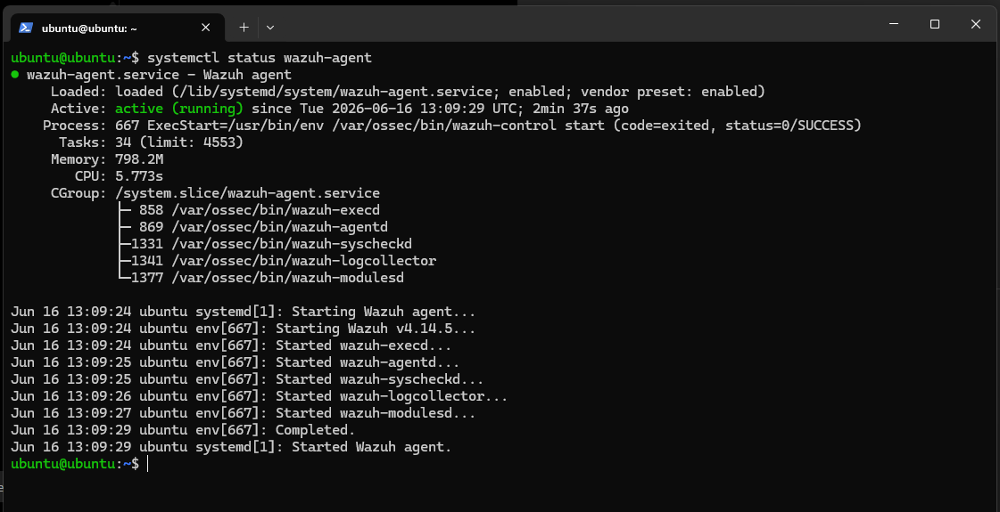
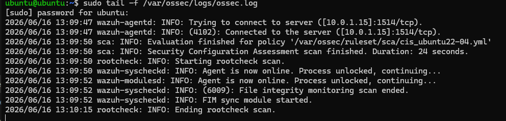
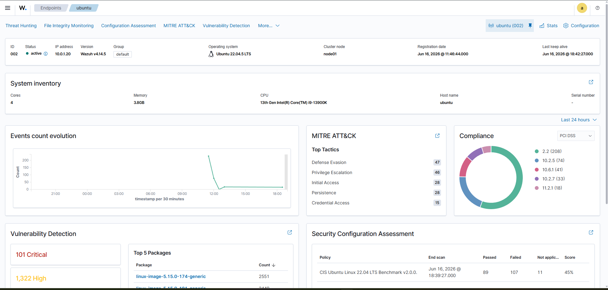
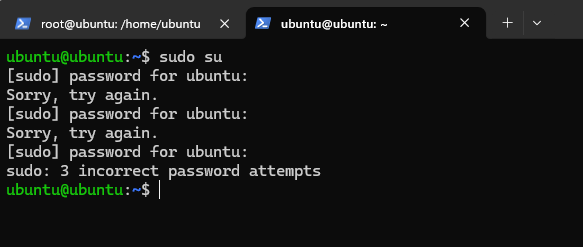
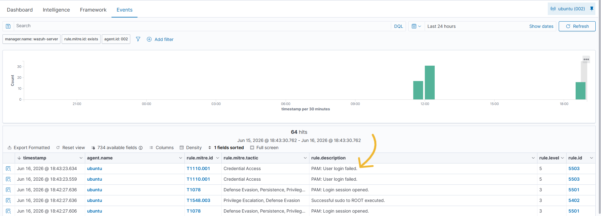
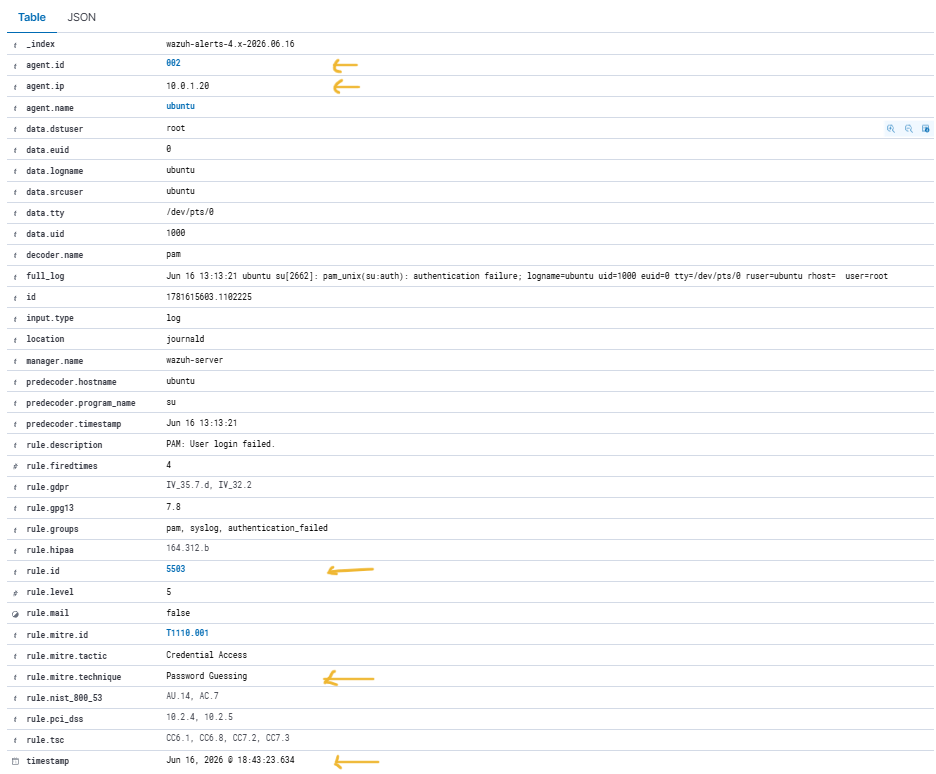
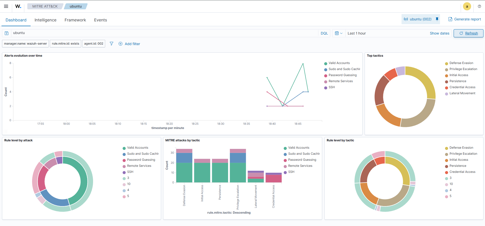

# Day 06 - Wazuh Agent Onboarding & Basic Alert Investigation

## Objective

Today I connected my Ubuntu VM to my Wazuh server and explored how Wazuh collects logs and converts them into security alerts.

The goal was to understand how a SIEM receives endpoint logs, analyzes events, and provides visibility into authentication-related activity.

---

## Lab Environment

| Component    | IP Address |
| ------------ | ---------- |
| Wazuh Server | 10.0.1.15  |
| Ubuntu Agent | 10.0.1.20  |
| Kali Linux   | 10.0.1.21  |
| pfSense      | 10.0.1.1   |

Environment hosted inside my Proxmox homelab.

---

## Task 1 - Verify Wazuh Agent Installation

Checked the Wazuh agent service on the Ubuntu VM.

Command:

```bash
systemctl status wazuh-agent
```

Verified:

* Agent service is running
* Service is enabled
* No startup errors were observed



---

## Task 2 - Verify Agent Connectivity

Monitored the Wazuh agent logs to confirm communication with the Wazuh manager.

Command:

```bash
sudo tail -f /var/ossec/logs/ossec.log
```

Observed:

```text
Connected to the server
Agent is now online
```

This confirmed that the Ubuntu endpoint successfully registered and established communication with the Wazuh server.



---

## Task 3 - Confirm Agent Appears in Dashboard

Opened the Wazuh dashboard and verified that the Ubuntu system appeared as an active endpoint.

Information observed:

* Agent ID: 002
* Status: Active
* Hostname: ubuntu
* IP Address: 10.0.1.20
* Wazuh Version: 4.14.5



---

## Task 4 - Generate Authentication Failure Events

To generate security events, I intentionally entered an incorrect password multiple times while attempting to use sudo.

Command:

```bash
sudo su
```

Result:

```text
sudo: 3 incorrect password attempts
```

This created authentication failure entries in the system logs, which were later processed by Wazuh.



---

## Task 5 - Investigate Wazuh Alert Rule 5503

After the failed authentication attempts, Wazuh generated an alert.

Rule Details:

| Field           | Value                  |
| --------------- | ---------------------- |
| Rule ID         | 5503                   |
| Level           | 5                      |
| Description     | PAM: User login failed |
| MITRE Technique | T1110.001              |
| MITRE Tactic    | Credential Access      |

The alert was mapped to the MITRE ATT&CK technique **Password Guessing (T1110.001)**.



---

## Task 6 - Investigate Alert Details

Opened the alert details page to examine the raw log data collected by Wazuh.

Observed fields:

* Agent Name: ubuntu
* Agent IP: 10.0.1.20
* Rule ID: 5503
* Authentication Failure Event
* Technique : Password guessing 
* Tactic : Credentials acess

Relevant log excerpt:

```text
pam_unix(sudo:auth): authentication failure
```

This helped demonstrate how Wazuh parses raw Linux logs and converts them into structured security alerts.



---

## Task 7 - Explore MITRE ATT&CK Mapping

Opened the MITRE ATT&CK section in Wazuh and reviewed how alerts are categorized.

Observed tactics included:

* Credential Access
* Privilege Escalation
* Defense Evasion
* Initial Access
* Persistence

This feature helps analysts quickly understand the attacker behavior associated with security events.



---

## What I Learned

* Wazuh agents collect logs from monitored endpoints.
* Endpoint events are forwarded to the Wazuh manager for analysis.
* Failed authentication attempts generate security alerts automatically.
* Wazuh maps alerts to MITRE ATT&CK techniques and tactics.
* Security events can be investigated through detailed log records.
* SIEM platforms help centralize and automate security monitoring.

---

## Key Alert Observed

### Rule 5503

Description:

```text
PAM: User login failed
```

MITRE Mapping:

```text
T1110.001 - Password Guessing
```

Tactic:

```text
Credential Access
```

---

## Conclusion

Today I successfully onboarded an Ubuntu endpoint into Wazuh and verified communication between the agent and the server.

By generating failed authentication attempts, I observed how Wazuh collects Linux logs, creates security alerts, and maps events to the MITRE ATT&CK framework.

This was my first hands-on experience using a SIEM platform inside my homelab environment.
