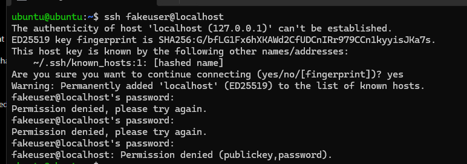
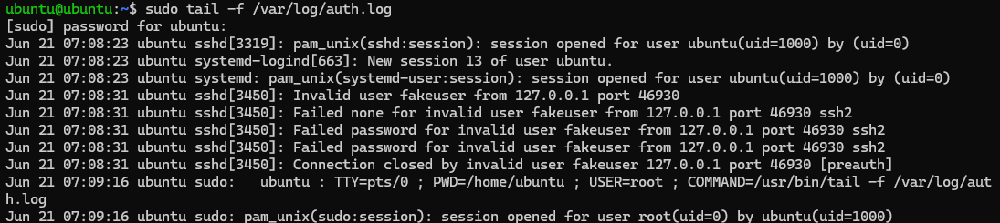
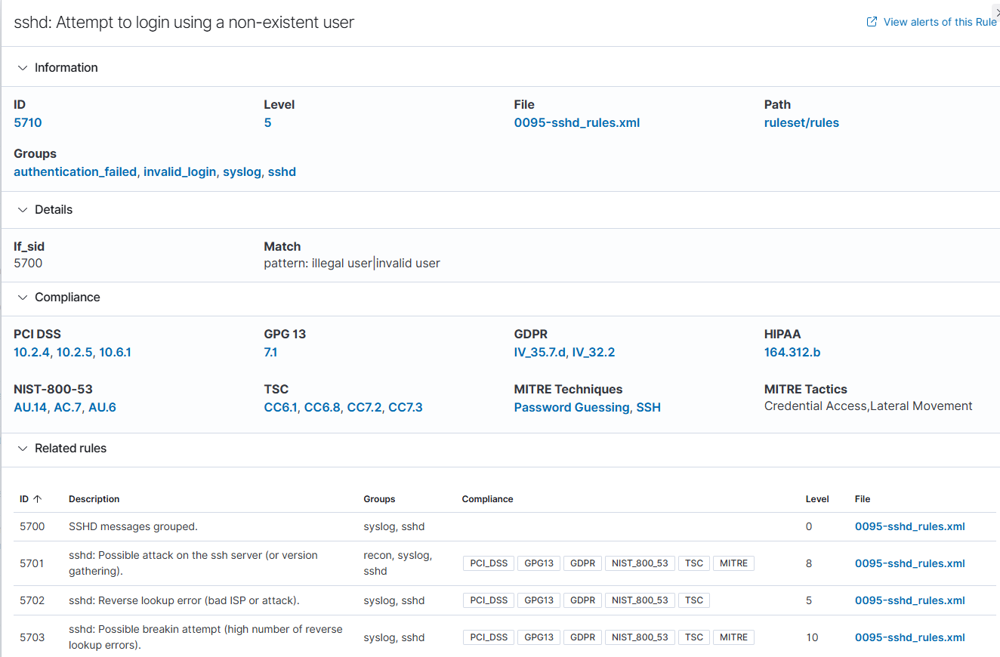
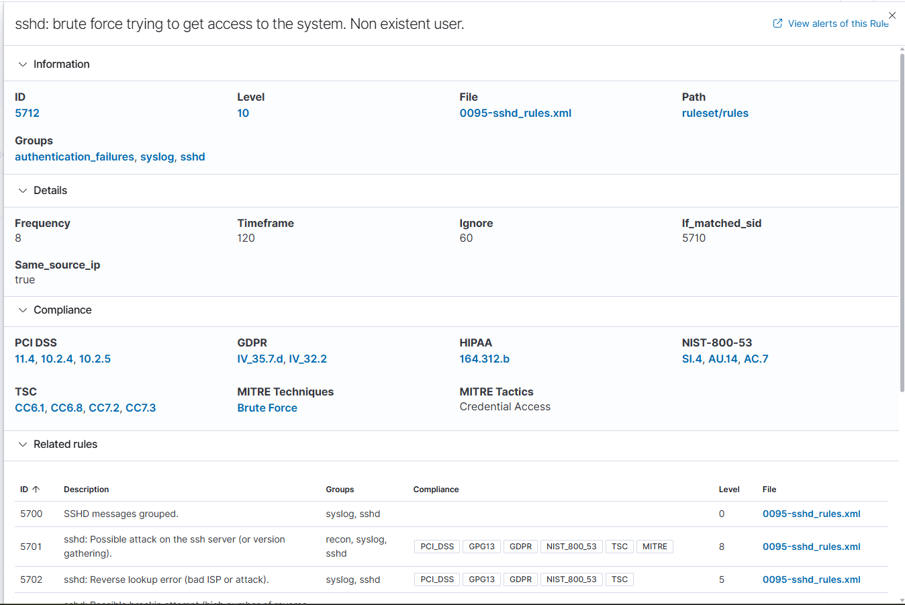

# Day 07 - SSH Brute Force Detection & Alert Investigation

## Objective

Today I simulated an SSH login attack against my Ubuntu VM and investigated how Wazuh detected and classified the activity.

The goal was to understand how SSH authentication logs are processed, how Wazuh correlates multiple failed login attempts, and how a SOC analyst investigates authentication-related alerts.

---

## Lab Environment

| Component    | IP Address |
| ------------ | ---------- |
| Wazuh Server | 10.0.1.15  |
| Ubuntu Agent | 10.0.1.20  |
| Kali Linux   | 10.0.1.21  |
| pfSense      | 10.0.1.1   |

Environment hosted inside my Proxmox homelab.

---

# Task 1 - Simulate an SSH Login Attack

I attempted to log in to the local SSH server using a username that does not exist.

Command:

```bash
ssh fakeuser@localhost
```

After accepting the SSH fingerprint, I entered an incorrect password multiple times.

Result:

```text
Permission denied, please try again.
Permission denied, please try again.
fakeuser@localhost: Permission denied (publickey,password).
```

This generated authentication failure events in the Linux system logs.



---

# Task 2 - Review Linux Authentication Logs

I monitored the authentication log to verify that the SSH daemon recorded the failed login attempts.

Command:

```bash
sudo tail -f /var/log/auth.log
```

Observed log entries:

```text
Invalid user fakeuser from 127.0.0.1
Failed none for invalid user fakeuser
Failed password for invalid user fakeuser
Connection closed by invalid user
```

These entries confirmed that the SSH server rejected the authentication attempts because the specified user account did not exist.



---

# Task 3 - Investigate Rule 5710

After reviewing the alerts in Wazuh, I observed that Rule **5710** was triggered.

Rule Details:

| Field       | Value                                       |
| ----------- | ------------------------------------------- |
| Rule ID     | 5710                                        |
| Description | SSH login attempt using a non-existent user |
| Decoder     | sshd                                        |

This rule detects individual SSH authentication attempts made using usernames that do not exist on the system.



---

# Task 4 - Investigate Rule 5712

Wazuh later generated Rule **5712**.

Rule Details:

| Field           | Value                                                                    |
| --------------- | ------------------------------------------------------------------------ |
| Rule ID         | 5712                                                                     |
| Level           | 10                                                                       |
| Description     | sshd: brute force trying to get access to the system. Non existent user. |
| Decoder         | sshd                                                                     |
| MITRE Technique | T1110 - Brute Force                                                      |
| MITRE Tactic    | Credential Access                                                        |

Unlike Rule 5710, this rule is a correlation rule that identifies repeated failed SSH authentication attempts.



---

# Task 5 - Understand Rule Correlation

I explored the Rule 5712 details page to understand why the alert was generated.

Important observations:

- Frequency: **8**
- Timeframe: **120 seconds**
- Same Source IP: **true**
- If Matched SID: **5710**

This means Wazuh waits for multiple Rule 5710 events from the same source IP within the configured timeframe before generating Rule 5712.

Alert flow:

```text
SSH Login Attempt
        │
        ▼
auth.log
        │
        ▼
sshd Decoder
        │
        ▼
Rule 5710
(Login attempt using a non-existent user)
        │
Repeated failed attempts
        ▼
Rule 5712
(SSH brute-force detection)
```

---

# Task 6 - Investigate the Alert

I reviewed the alert details and correlated the information with the Linux authentication logs.

### Findings

| Question                   | Observation        |
| -------------------------- | ------------------ |
| Target Host                | Ubuntu (10.0.1.20) |
| Username                   | fakeuser           |
| Service                    | SSH                |
| Source IP                  | 127.0.0.1          |
| Decoder                    | sshd               |
| Authentication Successful? | No                 |

The source IP is **127.0.0.1** because the SSH connection originated from the same Ubuntu machine using `localhost`. If the attack had originated from my Kali VM, the source IP would have been **10.0.1.21**.

The authentication failed because the user account did not exist.

Relevant log entry:

```text
Failed password for invalid user fakeuser from 127.0.0.1 port 46930 ssh2
```


---

# What I Learned

- SSH authentication attempts are recorded in Linux authentication logs.
- Wazuh uses the **sshd** decoder to parse SSH-related events.
- Rule **5710** detects an SSH login attempt using a non-existent user.
- Rule **5712** is a correlation rule that detects repeated failed SSH login attempts.
- Rule correlation helps identify suspicious activity instead of treating every failed login as an isolated event.
- MITRE ATT&CK mapping provides additional context about attacker behavior.

---

# SOC Investigation Summary

## Incident Type

SSH authentication failure / suspected brute-force activity.

## Activity Observed

Multiple SSH login attempts were made using a non-existent user account named **fakeuser**.

## Detection

- Rule 5710
- Rule 5712

## MITRE ATT&CK

- Technique: **T1110 – Brute Force**
- Tactic: **Credential Access**

## Impact

Authentication was unsuccessful.

No user session was created and no shell access was obtained.

## Analyst Conclusion

I would classify this activity as a **failed brute-force attack**.

The attacker attempted to authenticate to the SSH service using a non-existent user account. Multiple authentication failures were recorded, and Wazuh correlated these events into Rule 5712. Although the login was unsuccessful, this type of activity should still be investigated because repeated authentication failures may indicate password guessing or reconnaissance.

---
