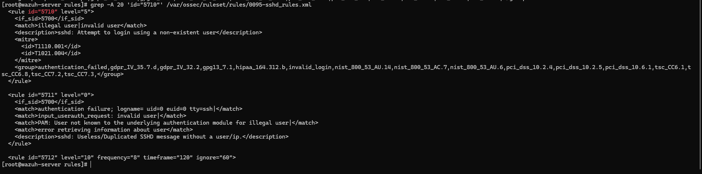
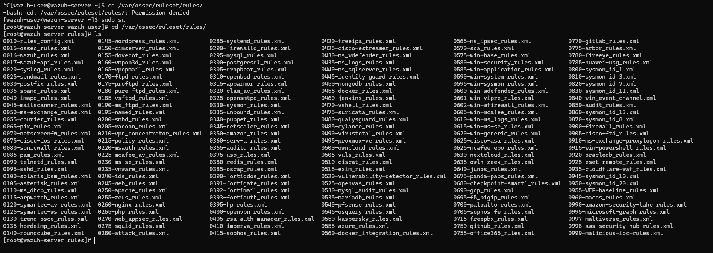
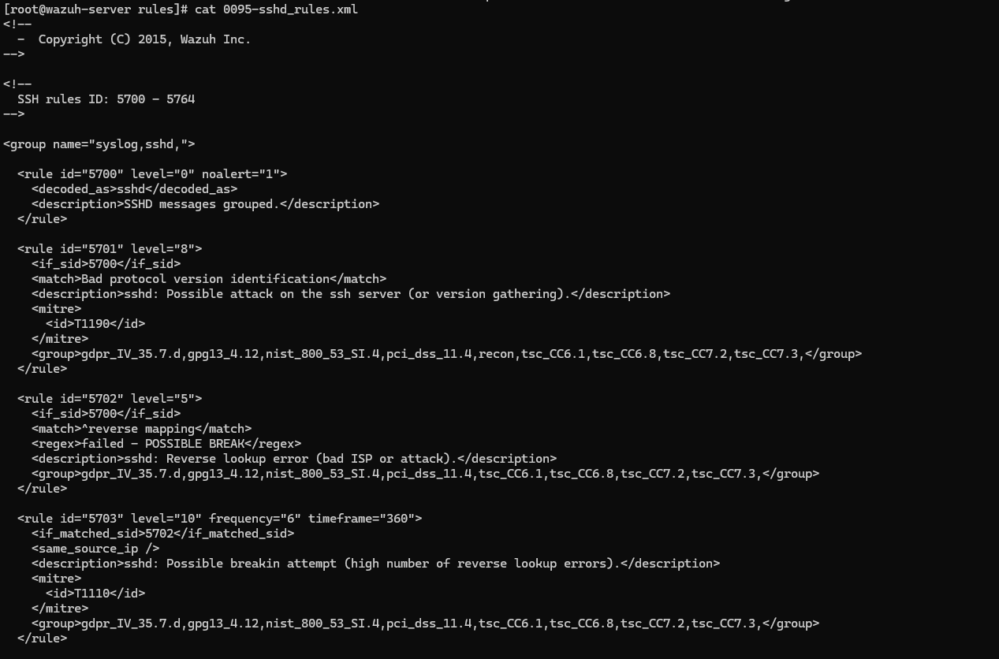
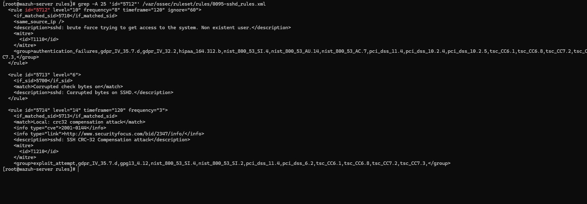

# Day 08 - Understanding Wazuh Rules, Decoders & Logtest

## Objective

Today I explored how Wazuh processes logs internally instead of generating new security events.

The goal was to understand how a raw log is transformed into a security alert by studying the Wazuh processing pipeline, using `wazuh-logtest`, and reviewing the built-in SSH detection rules.

---

# Task 1 - Understand the Wazuh Processing Pipeline

Before exploring the rules, I learned how Wazuh processes an incoming log.

Processing Flow:

```text
Application
        │
        ▼
Linux Log
        │
        ▼
Wazuh Logcollector
        │
        ▼
Pre-decoder
        │
        ▼
Decoder
        │
        ▼
Rule Engine
        │
        ▼
Alert
        │
        ▼
Indexer
        │
        ▼
Dashboard
```

This helped me understand the complete lifecycle of an event before it appears in the Wazuh dashboard.

---

# Task 2 - Test Logs Using wazuh-logtest

To understand how Wazuh analyzes logs, I used the built-in `wazuh-logtest` utility.

Command:

```bash
sudo /var/ossec/bin/wazuh-logtest
```

I tested the following SSH authentication log:

```text
Jun 21 07:08:31 ubuntu sshd[3450]: Failed password for invalid user fakeuser from 127.0.0.1 port 46930 ssh2
```

The tool processed the log in three phases.

---

## Phase 1 - Pre-decoding

Information extracted:

* Timestamp
* Hostname
* Program Name

Observed:

```text
Timestamp : Jun 21 07:08:31
Hostname  : ubuntu
Program   : sshd
```

The pre-decoder extracts basic information before the log is fully analyzed.

---

## Phase 2 - Decoding

The **sshd** decoder recognized the SSH log and extracted important fields.

Observed:

```text
Decoder : sshd
Source IP : 127.0.0.1
Username : fakeuser
```

At this stage, the raw log becomes structured information that can be evaluated by the rule engine.

---

## Phase 3 - Rule Matching

The decoded event matched Rule **5710**.

Observed:

| Field       | Value                                      |
| ----------- | ------------------------------------------ |
| Rule ID     | 5710                                       |
| Level       | 5                                          |
| Description | Attempt to login using a non-existent user |

The tool indicated that an alert would be generated for this event.



---

# Task 3 - Explore the Wazuh Rules Directory

I explored the Wazuh rules directory on the server.

Directory:

```bash
cd /var/ossec/ruleset/rules/
```

The directory contains hundreds of XML rule files for different operating systems, applications, firewalls, and security tools.

Some examples include:

* SSH
* Apache
* Nginx
* Suricata
* pfSense
* Sysmon
* Windows Security
* Docker
* VirusTotal

This demonstrated how Wazuh supports many different log sources using predefined rule sets.



---

# Task 4 - Explore SSH Rules

I opened the SSH rules file.

Command:

```bash
cat /var/ossec/ruleset/rules/0095-sshd_rules.xml
```

This XML file contains the detection logic used for SSH events.

I observed rules such as:

* Rule 5700
* Rule 5701
* Rule 5702
* Rule 5710
* Rule 5712

Each rule defines when an alert should be generated based on the decoded log data.



---

# Task 5 - Understand Rule 5712

I examined the XML definition for Rule **5712**.

Command:

```bash
grep -A 25 'id="5712"' /var/ossec/ruleset/rules/0095-sshd_rules.xml
```

Important observations:

| Property       | Value       |
| -------------- | ----------- |
| Rule ID        | 5712        |
| Level          | 10          |
| Frequency      | 8           |
| Timeframe      | 120 seconds |
| if_matched_sid | 5710        |
| same_source_ip | true        |

Rule description:

```text
sshd: brute force trying to get access to the system. Non existent user.
```

From this rule, I learned that Wazuh does not generate Rule 5712 from a single log entry.

Instead, it waits until Rule 5710 has been triggered multiple times from the same source IP within the configured timeframe before raising a brute-force alert.



---

# Understanding Rule Correlation

The relationship between the SSH logs and Wazuh rules can be represented as follows:

```text
SSH Login Attempt
        │
        ▼
auth.log
        │
        ▼
Logcollector
        │
        ▼
Pre-decoder
        │
        ▼
sshd Decoder
        │
        ▼
Rule 5710
(Login attempt using a non-existent user)
        │
Repeated events
        ▼
Rule 5712
(SSH brute-force detection)
        │
        ▼
Alert
        │
        ▼
Dashboard
```

This helped me understand how Wazuh performs rule correlation instead of treating every failed login as an independent event.

---

# Key Concepts Learned

## What is Pre-decoding?

Pre-decoding extracts basic information such as the timestamp, hostname, and program name before detailed analysis begins.

---

## What is a Decoder?

A decoder identifies the log format and extracts useful fields from the raw log.

For SSH events, the **sshd** decoder extracted:

* Source IP
* Username
* SSH service

---

## What is a Rule?

A rule contains the detection logic that determines whether an event should generate an alert.

Rules evaluate decoded log data and assign a severity level, description, and additional metadata.

---

## Why are Decoders Needed?

Raw logs are plain text.

Decoders convert them into structured data that rules can analyze efficiently.

---

## Why are Rules Applied After Decoding?

Rules require structured information such as usernames, IP addresses, and services.

Without decoding, Wazuh would not know which parts of the log represent these fields.

---

## What is wazuh-logtest?

`wazuh-logtest` is a testing tool that simulates how Wazuh processes a log.

It allows administrators to verify which decoder and rule match a log without waiting for a real event.

---

## Why did Rule 5710 Trigger?

Rule 5710 matched because the SSH log contained an authentication attempt using a username that did not exist on the system.

---

## Why didn't wazuh-logtest generate Rule 5712?

`wazuh-logtest` processes one log entry at a time.

Rule 5712 is a correlation rule that requires multiple Rule 5710 events within a specified timeframe before it is triggered.

---

# What I Learned

* Wazuh processes logs in multiple stages before creating alerts.
* Pre-decoding extracts basic information from raw logs.
* Decoders convert unstructured logs into structured fields.
* Rules analyze decoded data and determine whether an alert should be generated.
* Rule 5712 is a correlation rule that depends on multiple Rule 5710 events.
* `wazuh-logtest` is a useful tool for testing decoders and rules without generating real attacks.
* Reading the XML rule files helped me understand how Wazuh's built-in detections are implemented.

---

# Conclusion

Today I explored how Wazuh analyzes logs internally instead of focusing only on the dashboard.

By using `wazuh-logtest` and examining the built-in SSH rules, I gained a better understanding of how decoders, rules, and rule correlation work together to detect suspicious activity.

This gave me a clearer picture of how Wazuh transforms raw log data into meaningful security alerts.
