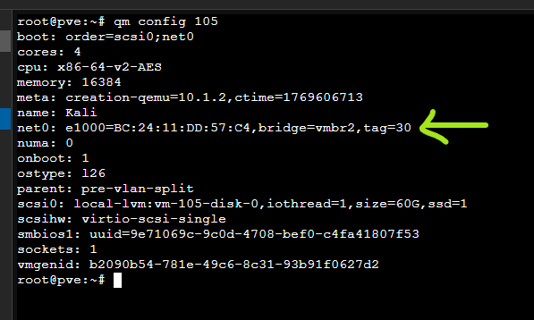
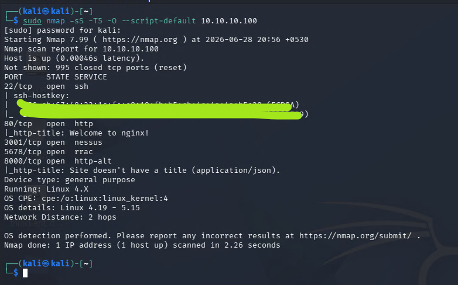
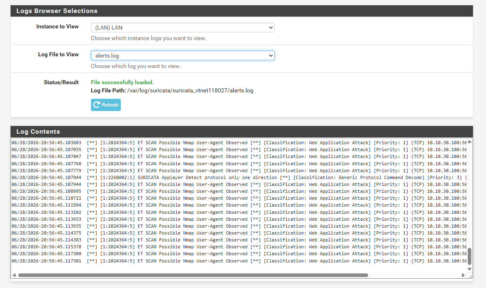

# Day 10 - Suricata IDS Detection, Debugging & VLAN Segmentation

## Objective

Today's goal was simple:

- Detect Nmap scans using Suricata.
- Verify that IDS rules are actually working.
- Understand why no alerts were showing up.
- Fix the issue properly instead of using a workaround.

---

## Initial Setup

Current Lab:

```
Internet
    │
Home Router
    │
Proxmox
    │
pfSense
    │
vmbr2
├── Kali
├── Ubuntu Server
├── Windows Workstation
├── Target Windows
├── Wazuh
└── NAS
```

Suricata was already installed on pfSense with ET Open rules enabled.

---

## First Test

From Kali I ran:

```
sudo nmap -sS -T5 -O --script=default 10.0.1.20
```

I expected Suricata to detect the scan.
and log it inside alert.json
But...

No Nmap alerts appeared.

Only normal DNS, HTTP and TLS events were visible in `eve.json`.

---

## First Assumption

I thought maybe:

- Rules were missing
- Rules were disabled
- Suricata not working
- rules not updating in suricata

So I started checking everything one by one.

---

## Things I Verified

I checked:

- ET Open rules downloaded successfully.
- Scan category enabled.
- Suricata service running.
- Correct rule files loaded.
- Nmap signatures existed inside suricata.rules.
- HOME_NET configured correctly.
- EVE logging enabled.

Everything looked correct.

Nothing appeared broken.

---

## The Big Discovery

While checking logs carefully, I found that alerts were actually being generated.

I simply wasn't looking in the correct place.

After checking:

```
grep '"event_type":"alert"' eve.json
```

I discovered alert events already existed.

So Suricata itself was working perfectly.

The problem was somewhere else.

---

## Finding the Real Problem

After checking the rule definitions, I noticed something important.

Many ET Open scan rules are written like this:

```
$EXTERNAL_NET -> $HOME_NET
```

But my lab looked like this:

```
Kali (10.0.1.x)
        │
Ubuntu (10.0.1.x)
```

Both machines were inside:

```
HOME_NET
```

So traffic became:

```
HOME_NET → HOME_NET
```

The rule expected:

```
EXTERNAL_NET → HOME_NET
```

Which means the signature could never match.

Nothing was actually broken.

Network architecture didnot let trigger any alert.

---

# Decided to Improve the Lab

Instead of changing HOME_NET manually, I decided to improve the lab architecture.

I created separate kali and Ubuntu using VLANs.

New design:

```
VLAN 10
Servers

Ubuntu
Windows
Wazuh
NAS

-----------------------

VLAN 30
Red Team

Kali
```

Now Kali behaves like an attacker network instead of another trusted host.

---

## Enabling VLAN Awareness

I edited:

```
/etc/network/interfaces
```

Enabled:

```
bridge-vlan-aware yes
```

Then applied changes:

```bash
ifreload -a
```

---

## Assigning VLAN Tags

I tagged my virtual machines.

### VLAN 10

- Ubuntu
- Windows Workstation
- Target Windows
- Wazuh
- NAS

### VLAN 30

- Kali Linux

pfSense LAN interface remained untagged because it carries multiple VLANs (trunk).



---

## Configuring pfSense

Inside pfSense I created:

```
VLAN 10
10.10.10.1/24

VLAN 30
10.10.30.1/24
```

Then:

- Assigned interfaces
- Enabled DHCP
- Created firewall rules
- Allowed communication between required VLANs

Machines received new IP addresses using DHCP mode i enable from dhcp server.

Ubuntu: 10.10.10.100

Kali: 10.10.30.100

---

## Testing Again

Now I scanned Ubuntu again.

```bash
sudo nmap -sS -T5 -O --script=default 10.10.10.100
```

The scan completed successfully.



---

## Success 🎉

This time Suricata generated many alerts.

Example:

```
ET SCAN Possible Nmap User-Agent Observed
```

Priority:

```
1
```

Source:

```
10.10.30.100
```

Destination:

```
10.10.10.100
```

This proved that the IDS was finally detecting my scan.

The issue was never Suricata itself.

It was my network design.



---

## What I Learned

Today taught me much more than just installing an IDS.

I learned:

- How ET Open rules work.
- Difference between HOME_NET and EXTERNAL_NET.
- Why network architecture matters.
- Why flat networks may not trigger certain IDS signatures.
- How to troubleshoot Suricata step by step.
- Basic VLAN segmentation in Proxmox.
- VLAN configuration in pfSense.
- How routing through pfSense changes traffic visibility.

---

## Problems Faced

- Initially thought Suricata was broken.
- i can see logs but no alerts.
- didnot updated rules first.
- Flat network prevented scan rules from matching.

---

## Final Result

- Suricata working
- ET Open rules working
- Nmap detection working
- VLAN segmentation completed
- Better lab architecture
