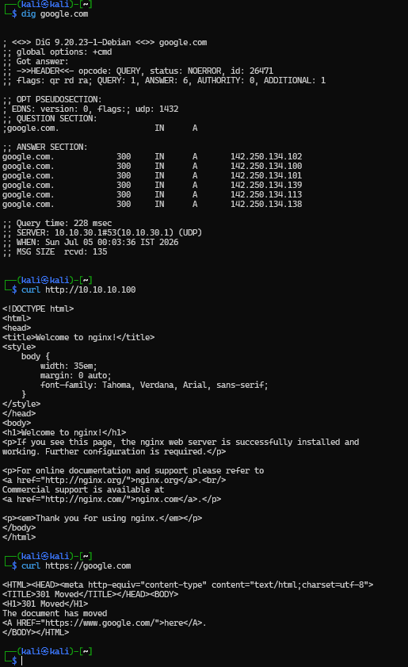
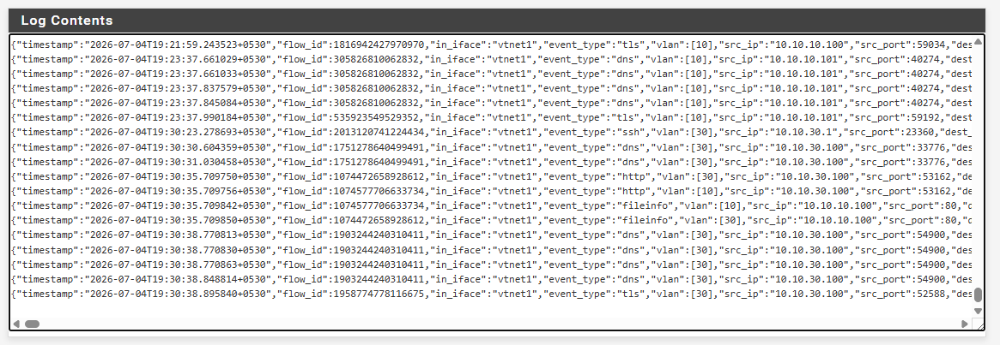
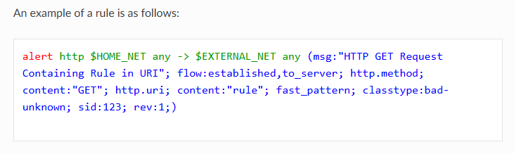
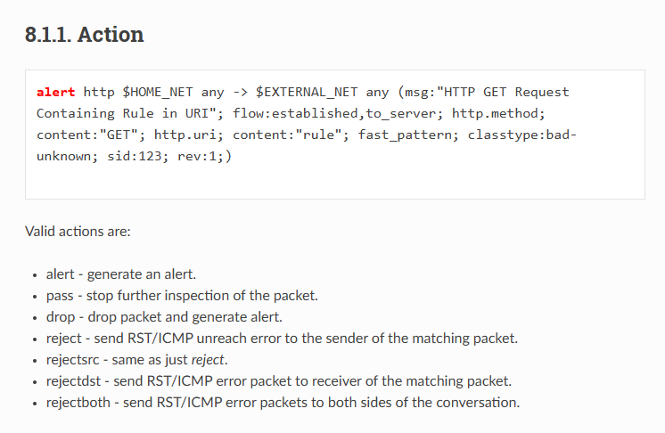
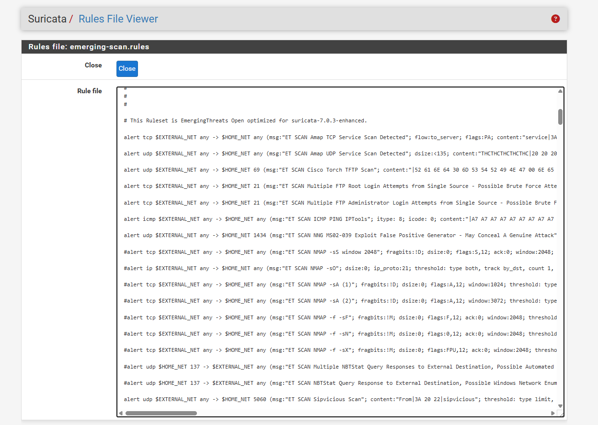

# Day 11 - Understanding How Suricata Works

## Objective

After successfully detecting Nmap scans yesterday, I wanted to understand **how Suricata actually makes those decisions**.

Instead of installing another security tool, I spent today learning:

- How Suricata processes packets
- Difference between protocol events and alerts
- Basic structure of a Suricata rule
- Why some traffic generates alerts while other traffic doesn't

---

## Understanding Suricata's Workflow

Every packet that reaches Suricata goes through multiple stages.

```
Packet
   │
   ▼
Packet Decoder
   │
   ▼
Protocol Detection
   │
   ▼
Application Layer Parser
   │
   ▼
Rule Engine
   │
   ▼
Alert (Only if a rule matches)
   │
   ▼
eve.json
```

One thing I misunderstood before was thinking every packet should generate an alert.

That isn't true.

Most packets only generate protocol logs. Alerts are generated only when an IDS signature matches the traffic.

---

## Protocol Events vs Alerts

To understand this better, I generated different types of traffic from my Kali machine.

### DNS

```bash
dig google.com
```

### HTTP

```bash
curl http://10.10.10.100
```

### HTTPS

```bash
curl https://google.com
```



---

After opening `eve.json`, I noticed that each command created a different event type.

For example:

- `dig` created a **dns** event.
- `curl http://...` created an **http** event.
- `curl https://...` created a **tls** event.

None of them generated alerts because none of the enabled IDS rules matched the traffic.



This helped me understand that **protocol events simply describe network traffic**, while **alerts indicate that a rule matched the traffic**.

---

## Learning Suricata Rule Structure

I then started reading the official Suricata documentation to understand how rules are written.

Example rule:



Breaking it down:

- **alert** → Action
- **http** → Protocol
- **$HOME_NET** → Source Network
- **$EXTERNAL_NET** → Destination Network
- **->** → Direction of traffic

Inside the brackets:

- **msg** → Alert message
- **flow** → Connection state
- **content** → Text or pattern to search for
- **sid** → Signature ID
- **rev** → Rule revision

At first the syntax looked complicated, but after breaking it into small parts it became much easier to understand.

---

## Rule Actions

Suricata supports multiple actions.



Some common ones are:

- **alert** → Generate an alert.
- **pass** → Ignore the packet.
- **drop** → Block the packet (IPS mode).
- **reject** → Reject the connection and notify the sender.

Since my lab is currently running in IDS mode, I mainly worked with **alert** rules.

---

## Looking at Real Rules

Instead of only reading documentation, I also explored the rules already installed on pfSense.

One file was:

```
emerging-scan.rules
```




It also reminded me why I had problems detecting Nmap scans before.

Most scan signatures expect traffic flowing from:

```
$EXTERNAL_NET
        ↓
$HOME_NET
```

last time I fixed my lab by separating Kali and the target systems into different VLANs, allowing those rules to match correctly.

---

## Biggest Lesson Today

The most important thing I learned is that **Suricata doesn't decide whether traffic is suspicious by itself.**

It simply checks whether the packet satisfies the conditions written inside a rule.

For example, a rule might ask:

```
Is this HTTP traffic?

↓

Is the connection established?

↓

Is traffic going to the server?

↓

Does the URI contain "/admin"?

↓

If YES → Generate an alert.
```

If even one condition is not satisfied, the rule doesn't match and no alert is generated.

Thinking about rules this way made them much easier to understand.

---

## What I Learned

Today I learned:

- Difference between protocol events and alerts.
- How Suricata processes packets.
- Basic Suricata rule structure.
- Purpose of `msg`, `flow`, `content`, `sid` and `rev`.
- Difference between `alert`, `drop`, `pass` and `reject`.
- How real ET Open rules are written.

This was mostly a theory day, but it helped me understand why Suricata behaves the way it does before I start creating my own custom rules.

## References

- Suricata Documentation  
  https://docs.suricata.io/en/suricata-8.0.5/rules/index.html

- Emerging Threats Open Rules  
  https://rules.emergingthreats.net/