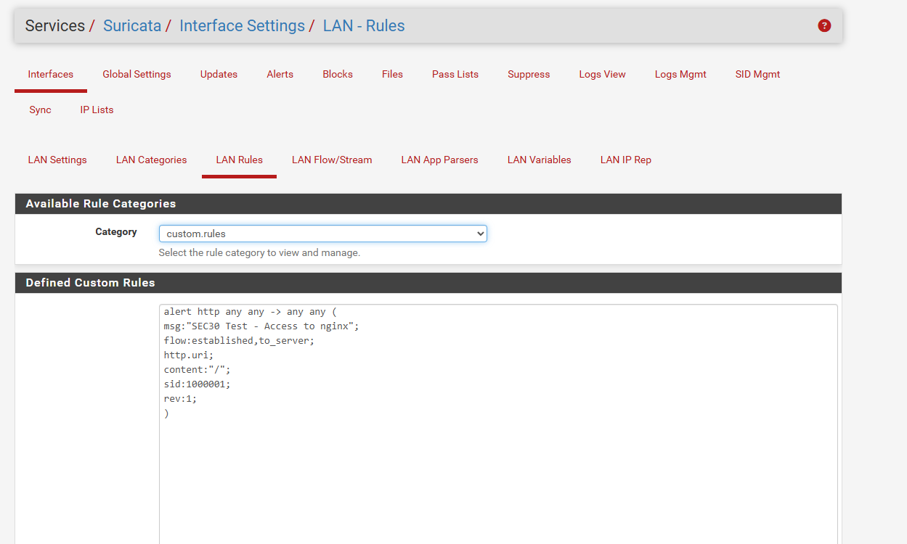
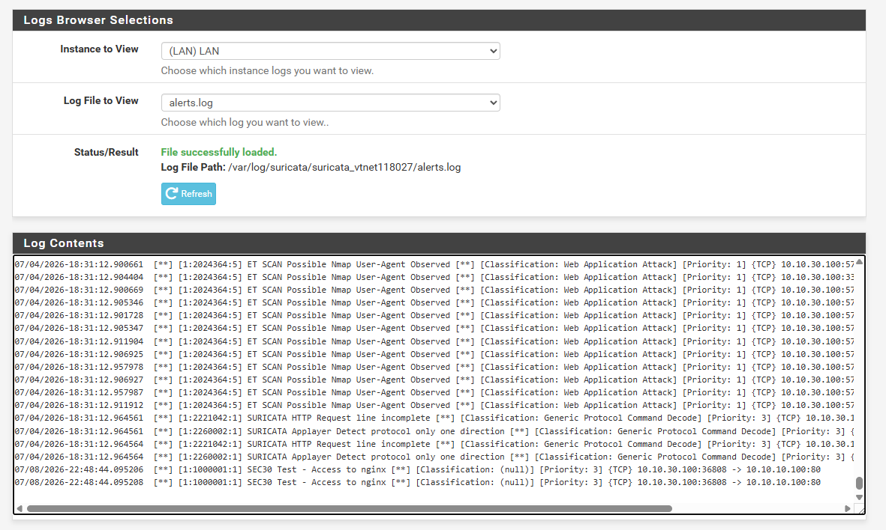

# Day 12 - Creating and Testing Custom Suricata Rules

## Objective

Today I wanted to understand how Suricata actually generates alerts.

Until now I was using ET Open rules, but I never wrote my own detection rule.

The goal was to:

- Understand how Suricata matches traffic with rules.
- Create my own custom rules.
- Generate traffic from Kali.
- Verify that my rules generate alerts successfully.

---

## Understanding the Detection Process

Whenever network traffic passes through Suricata, it first analyzes the protocol.

For example:

- DNS request
- HTTP request
- HTTPS connection
- TLS handshake

These are stored inside `eve.json` as **events**.

Suricata then compares every event with all enabled rules.

If any rule matches the traffic, it creates an alert.

So the process is:

```

Traffic
↓
Protocol Detection
↓
Event Generated (eve.json)
↓
Rule Matching
↓
Alert Generated (alerts.log)

```

---

## Existing HTTP Event

First I generated HTTP traffic from Kali.

```bash
curl http://10.10.10.100
```

Suricata generated an HTTP event inside `eve.json`.

Example:

```json
{
"event_type":"fileinfo",
"src_ip":"10.10.10.100",
"dest_ip":"10.10.30.100",
"http":{
"url":"/",
"http_method":"GET",
"status":200
}
}
```

Notice that this is only an event.

No alert is generated because no rule matched it.


---

## Writing My First HTTP Rule

I created a custom rule.

```suricata
alert http any any -> any any (
msg:"SEC30 Test - Access to nginx";
flow:established,to_server;
http.uri;
content:"/";
sid:1000001;
rev:1;
)
```

This rule simply says:

- Inspect HTTP traffic.
- Look for requests to `/`.
- Generate an alert.

### Screenshot


---

## Testing the Rule

From Kali I ran:

```bash
curl http://10.10.10.100
```

This time the request matched my custom rule.

Suricata generated:

```
SEC30 Test - Access to nginx
```

### Screenshot



---

## Creating a DNS Rule

Next I created a DNS rule.

```suricata
alert dns any any -> any any (
msg:"SEC30 Test - DNS lookup for google.com";
flow:to_server;
dns.query;
content:"google.com";
nocase;
sid:1000003;
rev:1;
)
```

This rule detects DNS lookups for **google.com**.

### Screenshot


---

## Testing the DNS Rule

From Kali I executed:

```bash
dig google.com
```

Suricata immediately generated:

```
SEC30 Test - DNS lookup for google.com
```

The alert showed:

- Source IP
- Destination IP
- UDP protocol
- Source port
- Destination port
- SID
- Priority

### Screenshot


---

## What I Learned About Suricata Rules

A Suricata rule contains different parts.

Example:

```suricata
alert http any any -> any any (
msg:"Example";
flow:established,to_server;
http.uri;
content:"/";
sid:1000001;
rev:1;
)
```

Meaning of each field:

| Field | Purpose |
|-------|---------|
| alert | Generate an alert |
| http | Inspect HTTP traffic |
| any any | Source IP and port |
| -> | Traffic direction |
| any any | Destination IP and port |
| msg | Alert message |
| flow | Direction of the connection |
| http.uri | Inspect the URL |
| content | Text to match |
| sid | Unique rule ID |
| rev | Rule revision |

---

## Understanding the Detection Flow

Today I understood that Suricata works in two stages.

### Stage 1

Generate protocol events.

Examples:

- DNS
- HTTP
- TLS
- SSH

These are stored inside `eve.json`.

### Stage 2

Compare every event with all enabled rules.

If a rule matches,

↓

Suricata creates an alert.

If IPS mode is enabled and the rule action is `drop` or `reject`, the traffic can also be blocked.

---

## Problems Faced

Initially my custom rules were not working.

The reason was that I wrote the rule across multiple lines inside pfSense's Custom Rules editor.

pfSense treated each line as a separate rule, which caused parsing errors.

After rewriting the rule on a single line and reloading the Suricata rules, the alerts started working correctly.

---

## Final Result

Successfully created custom HTTP and DNS detection rules.

Verified that:

- HTTP requests generated alerts.
- DNS queries generated alerts.
- Custom SID values were loaded successfully.
- Learned how Suricata matches events with rules before generating alerts.

This was my first step toward understanding how detection engineers create custom IDS signatures.