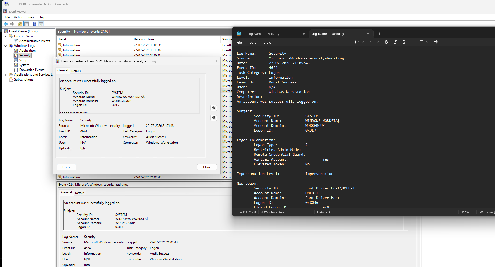
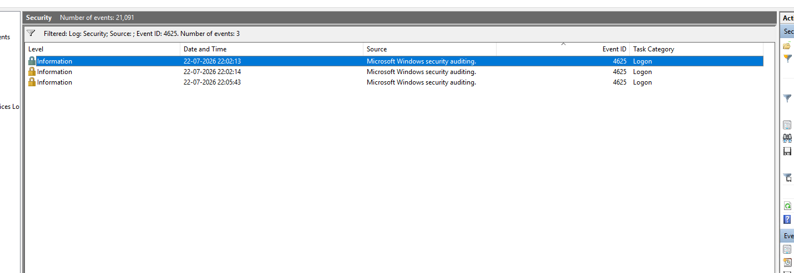
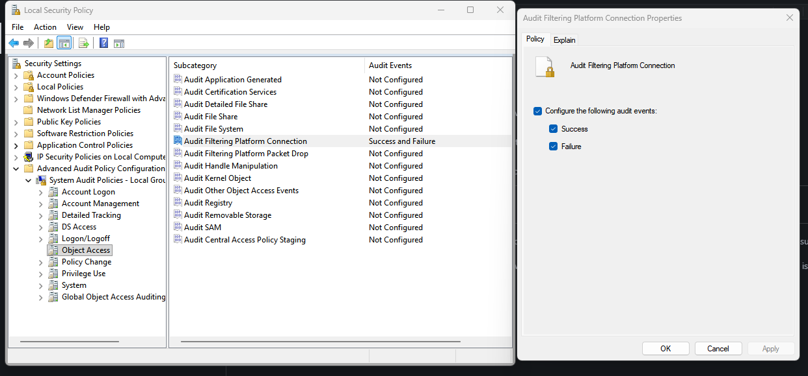

# Day 14 - Windows Event Log Analysis (4624 & 4625)

## Objective

Today I shifted my focus from network-level visibility (Suricata) to host-level visibility using Windows Event Viewer.

The goal was to understand:

- Successful logon events
- Failed logon events
- Windows Event IDs
- Authentication information
- XML representation of events
- Source IP identification
- Logon types
- Windows Filtering Platform events (5156)

---

## Lab Setup

| Machine | IP |
|--------|------|
| Kali Linux | 10.10.30.100 |
| pfSense | 10.10.10.1 |
| Windows Workstation | 10.10.10.103 |

---

## Experiment 1 - Successful Logon (Event ID 4624)

I filtered the Windows Security log for Event ID `4624`.

Observed:

- Event ID: 4624
- Description: Successful Logon
- Logon Type: 2
- Authentication Package: Negotiate
- Process Name: `winlogon.exe`



### Findings

I initially assumed every 4624 represented a human login. However, I discovered that Windows generates many internal authentication events.

Example:

```text
Target User:
UMFD-1

Domain:
Font Driver Host
````

`UMFD-1` stands for User Mode Font Driver Host, which is an internal Windows process.

### Key Learning

> Not every successful logon event represents a user authentication.

---

## Experiment 2 - Failed Logon (Event ID 4625)

I intentionally performed several failed authentication attempts against the Windows VM.

Windows generated:

```text
Event ID: 4625
```

Observed fields:

```text
Account Name:
test

Failure Reason:
Unknown user name or bad password

Source IP:
10.10.10.1

Authentication:
NTLM

Logon Type:
3
```

### Findings

```text
Status:
0xC000006D

SubStatus:
0xC0000064
```

These indicate:

* Authentication failure
* User account does not exist

### Key Learning

Windows provides sufficient information to identify:

* Source IP
* Username used
* Authentication mechanism
* Failure reason
* Logon type

This is exactly the information a SOC analyst would investigate during a brute-force attack.

---

## Experiment 3 - XML View

I opened the XML representation of both events.

Example:

```xml
<Data Name="IpAddress">
10.10.10.1
</Data>

<Data Name="TargetUserName">
test
</Data>

<Data Name="AuthenticationPackageName">
NTLM
</Data>
```

### Key Learning

The XML view contains all raw event information and is what SIEM solutions such as Wazuh, Splunk, and Microsoft Sentinel ingest for analysis.

---

## Experiment 4 - Windows Filtering Platform (Event ID 5156)

I attempted to generate:

```text
Event ID 5156
```

However, no events were generated.

### Findings

Event 5156 belongs to:

```text
Windows Filtering Platform
```

It is disabled by default on many Windows installations.

To enable:

```text
Local Security Policy
-> Advanced Audit Policy Configuration
-> Object Access
-> Audit Filtering Platform Connection
```

Enable:

* Success
* Failure

After enabling, Windows will log network connection information.

---

## Logon Types Learned

| Logon Type | Meaning                  |
| ---------- | ------------------------ |
| 2          | Interactive              |
| 3          | Network                  |
| 4          | Batch                    |
| 5          | Service                  |
| 7          | Unlock                   |
| 8          | Network Clear Text       |
| 10         | Remote Interactive (RDP) |
| 11         | Cached Interactive       |

---

## Major Learnings

1. Event ID 4624 indicates a successful authentication.
2. Event ID 4625 indicates a failed authentication.
3. Failed logins reveal source IP addresses.
4. Windows logs internal service activity as authentication events.
5. XML view exposes all raw event fields.
6. Windows Filtering Platform auditing is disabled by default.
7. Logon Type is extremely important during investigations.
8. Windows Event Viewer provides valuable forensic evidence.

---

## Conclusion

Today I learned how Windows records authentication events and how security analysts can use Event IDs 4624 and 4625 to investigate successful and failed logins.

This exercise helped me understand the difference between network visibility (Suricata) and host visibility (Windows Event Logs), which is an important concept in modern SOC operations.

